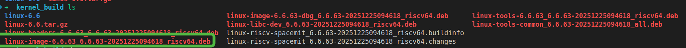
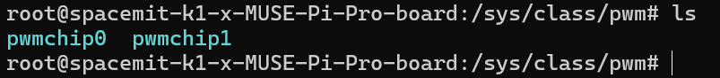
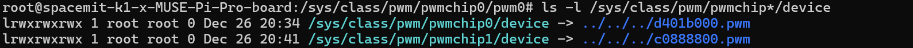

# 设备树配置

以  MUSE_PI_PRO pwm4 配置说明，其他板子类似

先下载内核：https://bianbu.spacemit.com/development/kernel_compile


## k1-x_pinctrl 确认或配置

找到文件：

```
linux-6.6/arch/riscv/boot/dts/spacemit/k1-x_pinctrl.dtsi
```

搜索 pwm4

```
	pinctrl_pwm4_0: pwm4_0_grp {
		pinctrl-single,pins = <
			K1X_PADCONF(MMC1_CMD, MUX_MODE5, (EDGE_NONE | PULL_UP | PAD_3V_DS4))	/* pwm4 */
		>;
	};

	pinctrl_pwm4_1: pwm4_1_grp {
		pinctrl-single,pins = <
			K1X_PADCONF(GPIO_34, MUX_MODE3, (EDGE_NONE | PULL_UP | PAD_1V8_DS2))	/* pwm4 */
		>;
	};
```

有些 pwm 已经配置，可以直接使用，这里确认一下即可，这里的 pinctrl_pwm4_0、pinctrl_pwm4_1 是独立的，表示两种可选的方案，后续可在dts里面选择。

如果遇到没有配置的 pwm, 参考此处配置即可

在本示例中，我们使用的是 pinctrl_pwm4_1 这个配置，即将 pwm 绑定到 GPIO34 引脚


## k1-x.dtsi 确认或配置

定位到文件：

```
linux-6.6/arch/riscv/boot/dts/spacemit/k1-x.dtsi
```

确认或新增 pwm4 的配置

```
		pwm4: pwm@d401b000 {
			compatible = "spacemit,k1x-pwm";
			reg = <0x0 0xd401b000 0x0 0x10>;
			#pwm-cells = <1>;
			clocks = <&ccu CLK_PWM4>;
			resets = <&reset RESET_PWM4>;
			k1x,pwm-disable-fd;
			status = "okay";
		};
```

注意把 status 改为 okay


## dts配置

找到文件：

```
linux-6.6/arch/riscv/boot/dts/spacemit/k1-x_MUSE-Pi-Pro.dts
```

找到 pwm4 如下：

```
&pwm4 {
	pinctrl-names = "default";
	pinctrl-0 = <&pinctrl_pwm4_1>;
	status = "okay";
};
```

把 status 配置为 okay

注意使用 pinctrl_pwm4_1 这个配置，否则无法在引脚 34 使用 PWM


## 编译内核

配置完成后编译内核

参考：https://bianbu.spacemit.com/development/kernel_compile

**这里给出快速参考命令：**

设置工具链地址：

```
 export PATH=~/WorkSpace/spacemit-toolchain-linux-glibc-x86_64-v1.0.0/bin:$PATH
```

编译出新的内核deb包

```
export ARCH=riscv
export CROSS_COMPILE=riscv64-unknown-linux-gnu-
make k1_defconfig
# 再次确认工具链是否正确
riscv64-unknown-linux-gnu-gcc --version

KERNELRELEASE=6.6.63 \
LOCALVERSION="" \
KDEB_SOURCENAME=linux-riscv-spacemit \
KDEB_PKGVERSION=6.6.63-$(TZ=Asia/Shanghai date +"%Y%m%d%H%M%S") \
KDEB_CHANGELOG_DIST=noble-porting \
make -j$(nproc) bindeb-pkg
```


## 替换内核

编译产物：



把 linux-image-6.6.63_6.6.63-20251225094618_riscv64.deb 拷贝到板子上

```
sudo apt install ./ linux-image-6.6.63_6.6.63-20251225094618_riscv64.deb
```

```
sudo reboot
```

等待重启完成


## 查看是否配置成功



PWM 子系统会暴露设备节点

运行： `ls -l /sys/class/pwm/pwmchip*/device`



可以看到，pwmchip0 与上面 k1-x.dtsi 里面配置的 pwm4 的 reg 字段一样，因此在这里使用 pwmchip0 

pwmchip1 是内核顺带注册，不用管