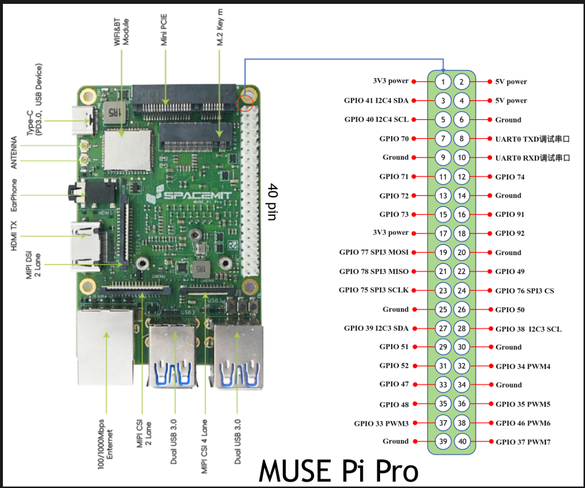

# 引脚编号

# 引脚可用复用

这里列出上面所有引出引脚的可用复用，可给配置内核设备树提供信息

只列出已引出的引脚

默认配置：表示默认设置的引脚复用功能，没有设置则为空，为空或配置为gpio时，该引脚可以使用基本输入输出功能。

数字表示 pinctrl 里面引脚相关复用功能对应的模式。

|    引脚编号    | 默认配置 |    0    |       1       |       2       |     3     |       4       |    5     |
| :------------: | :------: | :-----: | :-----------: | :-----------: | :-------: | :-----------: | :------: |
|     GPIO41     |          |  gpio   |   gmac1_mdc   |   i2c4_sda    |           |     pwm11     |          |
|     GPIO40     |          |         |  gmac1_tx_en  |   i2c4_scl    |           |     pwm10     |          |
| GPIO70/PRI_TDI |          | pri_tdi |               |   i2c2_scl    |   dclk    |   uart5_txd   |          |
| GPIO71/PRI_TMS |          | pri_tms |               |   i2c2_sda    |    dcx    |   uart5_rxd   |          |
| GPIO72/PRI_TCK |          | pri_tck |               |   uart9_txd   |    din    |  uart5_cts_n  |          |
| GPIO73/PRI_TDO |          | pri_tdo |               |   uart9_rxd   |   dout0   |  uart5_rts_n  |          |
|     GPIO77     |          |         |   ssp2_txd    |   ssp3_txd    | i2c3_scl  |  uart8_cts_n  |          |
|     GPIO78     |          |         |   ssp2_rxd    |   ssp3_rxd    | i2c3_sda  |  uart8_rts_n  |          |
|     GPIO75     |          |         |   ssp2_sclk   |   ssp3_sclk   |  can_tx0  |   uart8_txd   |          |
|     GPIO39     |          |         |  gmac1_tx_d3  |   i2c3_sda    |           |     pwm9      |          |
|     GPIO51     |          |         |               |  r_uart1_txd  |           |   i2c4_scl    |          |
|     GPIO52     |          |         |               |  r_uart1_rxd  |           |   i2c4_sda    |          |
|     GPIO47     |          |         |               |   r_can_tx    |           |   i2c3_scl    | one_wire |
|     GPIO48     |          |         |               |   r_can_rx    |  r_ir_rx  |   i2c3_sda    |          |
|     GPIO33     |          |         |  gmac1_rx_d2  |   uart4_txd   |   pwm3    |  PCIe1_waken  |          |
|                |          |         |               |               |           |               |          |
|     GPIO74     |          |         |               |   rcpu_pwm9   |   dout1   |  PCIe2_waken  |          |
|     GPIO91     |          |         |    mn_clk2    |  vcxo_out_0   |  dsi_te   |               |          |
|     GPIO92     |          |         |    mn_clk     |     pwm7      | smpn_rstb |               |          |
|     GPIO49     |          |         |               | r_uart1_cts_n |           |               |          |
|     GPIO76     |          |         |   ssp2_frm    |   ssp3_frm    |  can_rx0  |   uart8_rxd   | i2c4_sda |
|     GPIO50     |          |         |               | r_uart1_rts_n |           |               |          |
|     GPIO38     |          |         |  gmac1_tx_d2  |   i2c3_scl    |           |     pwm8      |          |
|     GPIO34     |          |         |  gmac1_rx_d3  |   uart4_rxd   |   pwm4    | PCIe1_clkreqn |          |
|     GPIO35     |          |         |  gmac1_tx_d0  |  uart4_cts_n  |   pwm5    | PCIe2_perstn  |          |
|     GPIO46     |          |         | gmac1_clk_ref |               |           |     pwm16     |          |
|     GPIO37     |          |         |   gmac1_tx    |     pwm7      |           | PCIe2_clkreqn |          |
|                |          |         |               |               |           |               |          |

